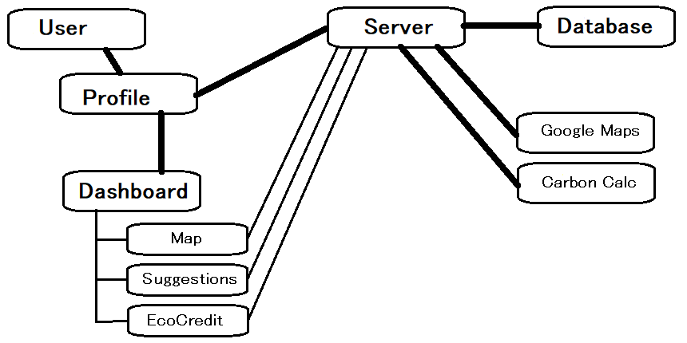
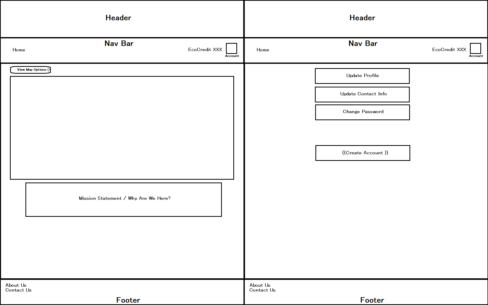

# eco-credit
## Project Board
[Github Project Board](https://github.com/BryantDavis1986/eco-credit/projects/1)

## Domain Model
  

## Database ERD
database name : eco-credit
relations:

profiles
id : SERIAL PRIMARY KEY
username : VARCHAR(20)
password : VARCHAR(20)

location
userid : SERIAL PRIMARY KEY
zipcode : INT(5)
lat : FLOAT
lon : FLOAT

surveyinfo
userid : SERIAL PRIMARY KEY
ecoscore : INT
energy : FLOAT
shower : INT
car_travel : FLOAT

carbon info
userid : SERIAL PRIMARY KEY
ecoscore : INT
energy : FLOAT
shower : FLOAT
car_travel : FLOAT

profiles  1 : many, linked with all	
location 1 : 1, with profiles	
surveyinfo 1 : 1, with profiles	
carboninfo 1 : 1, with profiles	